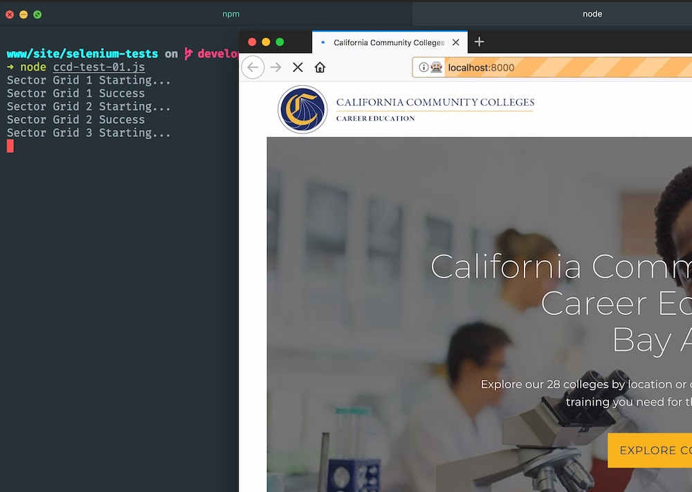

# Selenium Testing

## Introduction

[Selenium](https://www.seleniumhq.org/) automates browsers. It provides language bindings in JavaScript (and other languages) that let you execute high-level actions in the browser for testing web applications, as well as automating boring web administration tasks.

Some actions include:

- Navigate the browser to a URL
- Click a button.
- Wait for an element to be added to the DOM, become visible, etc.
- Take a screenshot.

Advantages: It's high level, and very faithful to the user experience. Disadvantage: It's very slow compared to JavaScript unit tests. Selenium can run locally (you'll see the browser do your actions), can be local "headless" (no visible browser) which runs faster, saves memory, and lets you do other stuff while you wait for tests to finish.

[Selenium Grid](https://github.com/SeleniumHQ/selenium/wiki/Grid2) lets you run tests in parallel on a grid of machines. This is nice because it's faster and you can test on many operating systems and browsers.

Many paid services let you run Selenium tests, such as:

- [BrowserStack](https://www.browserstack.com)
- [Sauce Labs](https://saucelabs.com)
- [Experitest](https://experitest.com)
- [CrossBrowserTesting](https://crossbrowsertesting.com)

[Jenkins](https://jenkins.io/doc/) is an automation server that can automate tasks related to testing web apps (as well as building and deploying them). Most often Jenkins is used to run JavaScript unit tests. But Jenkins can also run Selenium tests, and could be useful if you have many tests, or are using a Grid, etc.

For a browser instance to receive Selenium commands, you must have the Selenium browser driver installed. Drivers exist for all major browsers in many operating systems.

## Quick Start

### Download everything

First, we need to install the [Selenium Webdriver](https://www.npmjs.com/package/selenium-webdriver) node package to our project. This will let us write our tests in JavaScript, and it can convert them into Selenium browser commands. (There are also bindings for other languages including Python, etc)

```
yarn add selenium-webdriver
```

Next, we need to install [Firefox Geckodriver](https://github.com/mozilla/geckodriver/releases). Selenium drivers allow browsers to receive Selenium commands (browsers aren't Selenium-enabled by default). Drivers for most browsers [are available at SeleniumHQ](https://www.seleniumhq.org/download/). In my case, I downloaded the Firefox MacOS tarball into `~/selenium-browser-testing/` and extracted it. I added this path to the bottom of `~/.zshrc`:

```
# Add WebDriver browser drivers to PATH
export PATH=$PATH:/Users/jjahr/selenium-browser-testing
```

Next, restart your terminal. Now, enter `which geckodriver` and it should show that it can find the binary that it will run.

Now we're ready to run the tests!

### Prepare your tests

We'll run the tests on our local development server. So, fire up your local server with `npm start`, and grab the address (such as http://localhost:3000)

Next, set up your test. Copy the example test from this repo to your project, `selenium-tests/test.js`, and customize it with the path to your local development server and whatever tests you want to run.

### Run the test!

```
cd path/to/selenium-tests
node ccd-test-01.js
```

If the test works, you'll see a Firefox window appear, and see the viewport jump around, text get typed in, etc. You'll see console output:

```
[test name] Starting...
[test name] Success...
```


